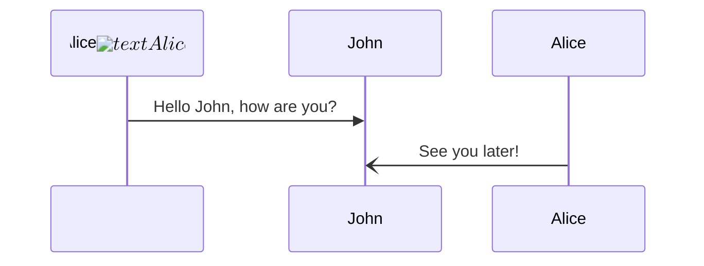

# fuzz-dict
用于fuzz测试的字典，收集网络上和自用字典

```mermaid
sequenceDiagram
    participant A as Alice<img src="x" onerror="alert(`xss on ${document.domain}`)">$$\\text{Alice}$$
    A->>John: Hello John, how are you?
    Alice-)John: See you later!
```
